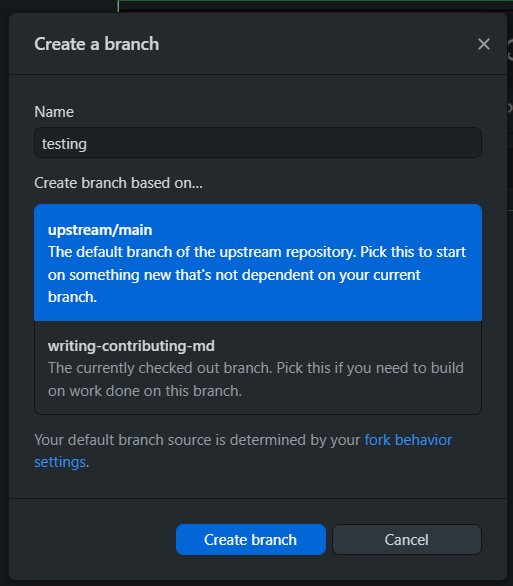

# Come contribuire al progetto

## Prerequisiti

Per poter contribuire al progetto è necessario installare i seguenti tool:

- [node.js](https://nodejs.org) (vanno bene entrambe le versioni disponibili: LTS e Current)

- [git](https://git-scm.com/book/en/v2/Getting-Started-Installing-Git) (quest'ultimo è già presente sulle distribuzioni di linux)

- [Github CLI](https://cli.github.com/manual/installation) (per eseguire tutte le operazioni da terminale), disponibile per tutti gli OS. 
Oppure, alternativamente, [Github Desktop](https://docs.github.com/en/desktop/installing-and-configuring-github-desktop/installing-and-authenticating-to-github-desktop/installing-github-desktop) (si tratta sostanzialmente della versione GUI di Github CLI), **quest'ultimo disponibile solo per Windows e macOS**.


Il primo è un runtime di JavaScript che permette di eseguire lo script (`esporta.js`) che converte il Markdown in un PDF pronto per essere stampato; gli altri sono necessari per creare e gestire la propria copia del progetto (sia in locale che su Github) e poter proporre modifiche all'originale tramite le pull request.

In seguito spiegheremo come utilizzare i tool, sia nel caso abbiate installato Github CLI, che nel caso abbiate installato Github Desktop.

## Con Github CLI

- ### Autenticazione

Per prima cosa sarà necessario effettuare il login (con le vostre credenziali di Github) su Github CLI attraverso il seguente comando.

```bash
gh auth login
```

Vi si presenteranno dei menù a scelta multipla, quando verrà richiesto il sito su cui autenticarvi selezionate Github.com.
Successivamente, per semplicità, consigliamo di scegliere il login attraverso web browser.

Seguite il processo di login inserendo i dati richiesti.

Quando sarà richiesto quale protocollo scegliere come default, consigliamo HTTPS.

###

<!-- - Installare node.js
- Installare Github CLI
- Installare git
- Fare l'autenticazione su Github CLI
- Vai nella cartella progetto
- gh repo fork m1gwings/ing-sw-cheatsheet --clone
- Vai nella cartella
- npm i
- Proviamo esportazione
- node esporta.js
- Creiamo nuovo branch per la feature
- git checkout -b prova-pull-request
- Pushare il branch
- git push -u origin <branch-name>
- Dopo aver lavorato, fare pull request sul sito
- git add .
- git commit
- Premere esc e poi digitare :wq
- git push
- gh pr create (selezionare la repository m1gwings, premere invio per skippare)
- Fare submit
- Se la pull request viene accettata:
- Cancellare il branch dal sito di GitHub
- git branch -d nomeDelBranchLocale
- git push origin --delete nomeDelBranchRemoto -->

---

## Con Github Desktop (solo per Windows e macOS)

- ### Installazione e Autenticazione

Procedete con l'installazione di Github Desktop dal [sito ufficiale](https://desktop.github.com/). 

Una volta installato autenticatevi con le vostre credenziali Github andando su File > Options > Accounts.

- ### Fork e Clone del progetto

Forkate il progetto andando sulla [pagina del progetto](https://github.com/m1gwings/ing-sw-cheatsheet) premendo su Fork in alto a destra.

Clonate la repository appena forkata, andando su Github Desktop e successivamente: File > Clone repository..., selezionate la repository di nome `ing-sw-cheatsheet`, imposta la cartella di destinazione e cliccate su Clone.

- ### Setup del progetto

Aprite la cartella del progetto, aprite il terminale e installate le dipendenze con il comando:

```bash
npm i
```

Dopo aver installato le dipendenze, provate a esportare il progetto in PDF con il comando:

```bash
node esporta.js
```

Se tutto è andato a buon fine, verrà generato il PDF `cheatsheet.pdf` nella stessa cartella.

- ### Contribuzione e creazione di una nuova feature

Per contribuire al progetto, prima di tutto, creiamo un nuovo branch per la feature che stiamo implementando (immaginando quindi di voler implementare il capitolo sul testing, il nome del branch che aggiungeremo sarà qualcosa di simile a `testing`).

Per aggiungere un nuovo branch, andate su Github Desktop e cliccate su Current branch > New branch... e inserite il nome del branch.



Switchate al nuovo branch appena creato, andando su Current branch e selezionando il branch appena creato. Dobbiamo ora aggiungere il branch alla repository in remoto cliccando su Publish branch (affianco a Current branch).

Possiamo ora iniziare a lavorare sulla nuova feature. Una volta terminata, salvate le modifiche e andate su Github Desktop. In alto a sinistra, nella sezione Changes, vedrete le modifiche che avete appena apportato. Selezionate le modifiche che volete aggiungere al progetto e cliccate sul pulsante `Commit to nomeDelBranch` in basso a sinistra (è importante aggiungere un titolo e una descrizione su cosa avete modificato/aggiunto).

Dobbiamo ora pushare i cambiamenti sulla repository in remoto, cliccate su Push origin in alto a destra.


- ### Creazione della pull request

Ci occupiamo ora di aggiornare la repository originale con le modifiche che abbiamo appena apportato. Per farlo, andiamo su Branch > Create pull request, vi si la pagina di Github con la pull rquest da submittare. Potete, quindi, aggiungere eventuali commenti e cliccare su Create pull request.

Se tutto è andato a buon fine, la pull request verrà accettata e la vostra feature verrà aggiunta al progetto.

- ### Aggiornamento del repository forkato

Può succedere che, nel frattempo scriviate la vostra feature, il repository originale abbia subito delle modifiche (le pull request di altri utenti sono state accettate  e mergiate sul main nel repository principale). Bisogna quindi aggiornare periodicamente il vostro repository forkato, soprattutto quando la vostra pull request viene accettata e mergiata. Per aggiornare il vostro repository remoto, andate sulla pagina web del vostro repository e cliccate su `Sync fork`.


Una volta fatto ciò, andate su Github Desktop e cliccate su `Fetch origin` in alto a destra. Se vi sono cambiamenti il tasto diventerà `Pull origin`, quindi cliccatelo. Il vostro progetto in locale è quindi aggiornato.

- ### Eliminazione del vecchio branch

La nostra feature è stata implementata nel main ed è presente sia nel repository principale che nel nostro repository forkato. Possiamo quindi switchare sul branch main ed eliminare il vecchio branch dal nostro repository locale e remoto. Per farlo, andate su Github Desktop e andate su Current branch > Tasto destro sul branch che abbiamo creato per implementare la feature > Delete... > Spuntate la casella `Yes, delete this branch on the remote` > Delete.


